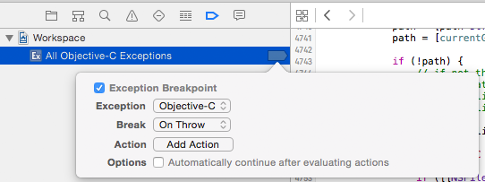
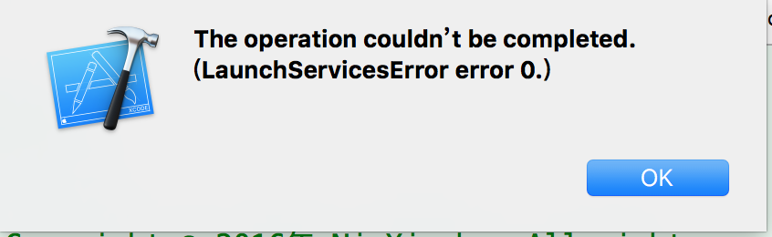

# ABBPlayerKit
playing and downloading

         实现功能 ：播放视频 ，后台下载 （真机调试功能正常）1、使用ZFPlayer播放视频
        （可以在线和本地播放，基于AVPlayer，播放格式：支持XVID/DIVX编码AVI,WMV,RMVB,ASF,H264,MKV等格式，同时支持SMI, SRT字幕）
        2、使用WHCNetWorkKit 实现下载，后台下载（一直保持下载）
        Function: Play video, background downloading (device debugging function is normal)
        1, using ZFPlayer play video (online and local playback) 
        2 Use WHCNetWorkKit Implementation, background downloading

# 实现功能 ：播放视频  后台下载

## 1、使用 [ZFPlayer](https://github.com/renzifeng/ZFPlayer) 播放视频（可以在线和本地播放）
## 2、使用[WHCNetWorkKit](https://github.com/netyouli/WHCNetWorkKit) 下载，后台下载
## 3、使用CoreModel 存储下载列表信息数据（已添加库，待加功能，当前存储是用NSKeyedUnarchiver）

# 设置

### CocoaPods 命令使用：

        $ cd /Users/wangzz/Desktop/CocoaPodsTest  
        $ touch Podfile  
        $ vim Podfile 

### 添加库
        pod 'Masonry'  (约束库)
        pod 'SDWebImage'  
        pod 'FDFullscreenPopGesture'
        pod 'WHCNetWorkKit' (下载库)
        //拖入ZFPlayer文件到项目中  (播放器)
        $ pod install --verbose --no-repo-update
        或者
        $ pod update --verbose --no-repo-update

### 项目设置
        1、项目（General） - Capabilities - Background Modes 开启（ON），Background fetch

        //添加_sqlite3.tbd 依赖（项目中导入了数据库操作库）

### 功能代码 （下载demo）

### 注意事项：
        1、播放音视频的demo设置全局断点All Exceptions 会导致（Xcode异常：0 __cxa_throw） libc++abi.dylib`__cxa_throw:0x10df1bc6b <+0>: pushq %rbp，........
        （但是不是崩溃，不连接xcode运行不会崩溃，连接xcode运行时就会停顿在这里），是因为添加了全局断点：All Exceptions，但是没有设置oc！

        2、播放界面不能横屏适配时，查看项目是否禁止横屏，否则需要强制设置该控制器横屏

        3、重新运行导致崩溃：

        解决办法：
        第1种方法.点击当前的模拟器，点击IOS Simulator->Reset Content and Settings...->Reset，然后会重置模拟器，再编译代码可登录模拟器成功
        第2种方法.点击Xcode->Product->Clean
        第3种方法.将模拟器上的当前运行的app删除，再重新加载(长按模拟器的屏幕，点击当前报错的app 删除)
        第4种方法.在info.plist文件中修改bundle的版本号
        我遇到的问题是上述几种方法只能暂时解决，当我一修改代码时，又重新报错，然后我把我项目里的那个Resources(就是存储图片的那个包)给删除了，然后重新建分组，但是资源包的名字不叫Resources,然后重新clean,结果问题解决了，我想原因可能是我的Resources与Xcode里冲突了，然后Xcode不能打包app到模拟器上吧​
        一般来说，手动删除了模拟器沙盒里面的文件夹，可能会出现这样的问题，最快捷有效的方法是重新设置模拟器，而不是重启模拟器。。。

##运行效果

[ZFPlayer播放展示图](https://github.com/renzifeng/ZFPlayer)

[WHCNetWorkKit下载展示图](https://github.com/netyouli/WHCNetWorkKit)

